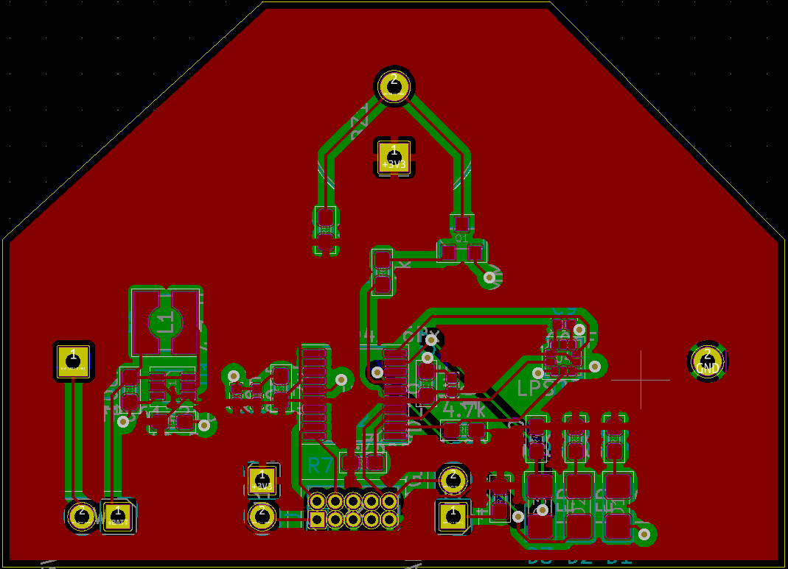
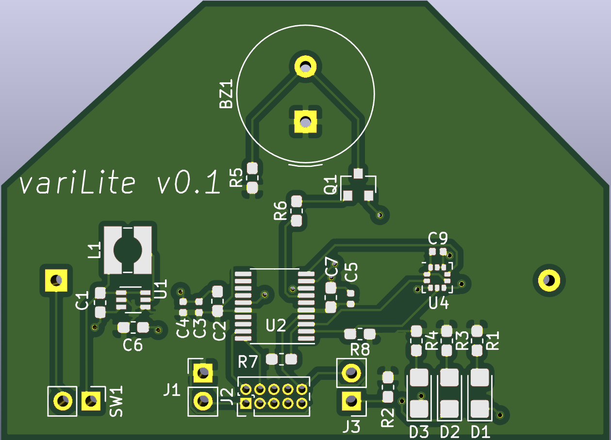

# variLite

The variLite is a minimalistic, open-source variometer design for freeflight and powered flight use cases such as paragliding, paramotoring, hanglinding etc. 

The design is yet to be manufactured, programmed, and tested. If working firmware is developed, it will be open-sourced as well and linked here

 
